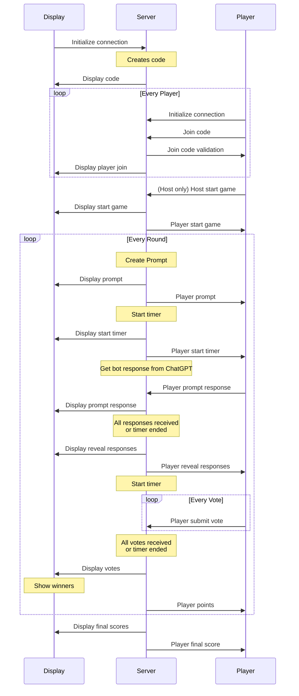

# bot-or-not

```mermaid
sequenceDiagram
    participant Display
    participant Server
    participant Player
    
    Display ->> Server: Initialize connection
    Note over Server: Creates code
    Server ->> Display: Display code
    loop Every Player
        Player ->> Server: Initialize connection
        Player ->> Server: Join code
        Server ->> Player: Join code validation
        Server ->> Display: Display player join
    end
    Player ->> Server: (Host only) Host start game
    Server ->> Display: Display start game
    Server ->> Player: Player start game
    loop Every Round
        Note over Server : Create Prompt
        Server ->> Display: Display prompt
        Server ->> Player: Player prompt
        Note over Server: Start timer
        Server ->> Display: Display start timer
        Server ->> Player: Player start timer
        Note over Server: Get bot response from ChatGPT
        Player ->> Server: Player prompt response
        Server ->> Display: Display prompt response
        Note over Server: All responses received<br />or timer ended
        Server ->> Display: Display reveal responses
        Server ->> Player: Player reveal responses
        Note over Server: Start timer
        loop Every Vote
            Player ->> Server: Player submit vote
        end
        Note over Server: All votes received<br />or timer ended
        Server ->> Display: Display votes
        Note over Display: Show winners
        Server ->> Player: Player points
    end
    Server ->> Display: Display final scores
    Server ->> Player: Player final score
```
