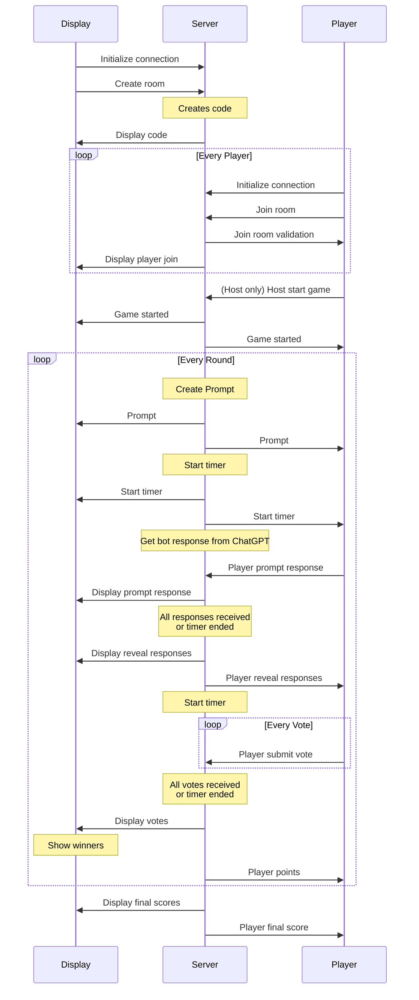

# bot-or-not



# Message structures

Display code 
``` json
{
    type: "display_code",
    message: {
        code: "1A2B"
    }
}
```

Join room
``` json
{
    type: "join_room",
    message: {
        code: "1A2B",
        name: "Johnny"
    }
}
```

Join room validation
``` json
{
    type: "join_room_validation",
    message: {
        validCode: true,
        validName: true,
        host: true
    }
}
```

Display player join
``` json
{
    type: "display_player_join",
    message: {
        name: "Johnny",
        host: true
    }
}
```

Host start game
``` json
{
    type: "host_start_game"
}
```

Game started
``` json
{
    type: "game_started"
}
```

Prompt
``` json
{
    type: "prompt",
    message: {
        prompt: "Here is a prompt"
    }
}
```

Start timer
``` json
{
    type: "start_timer"
}
```

Player prompt response
``` json
{
    type: "player_prompt_response",
    message: {
        response: "Here is a response"
    }
}
```

Display prompt response
``` json
{
    type: "display_prompt_response",
    message: {
        player: "Johnny",
        response: "Here is a response"
    }
}
```

Display reveal responses
``` json
{
    type: "display_reveal_responses",
    message: {
        bot_response: "Here is a bot response"
    }
}
```

Player reveal responses
``` json
{
    type: "player_reveal_responses",
    message: {
        responses: [
            "Here is a response",
            "Here is a bot response"
        ]
    }
}
```

Player submit vote
``` json
{
    type: "player_submit_vote",
    message: {
        response: "Here is a response"
    }
}
```

Display votes
``` json
{
    type: "display_votes",
    message: {
        responses : [
            {
                response: "Here is a response",
                votes: 2
            }
        ]
    }
}
```

Player points
``` json
{
    type: "player_points",
    message: {
        points: 200
    }
}
```

Display final scores
``` json
{
    type: "display_final_scores",
    message: {
        players: [
            {
                player: "Johnny",
                points: 200
            }
        ]
    }
}
```

Player final score
``` json
{
    type: "player_final_score",
    message: {
        points: 200
    }
}
```
